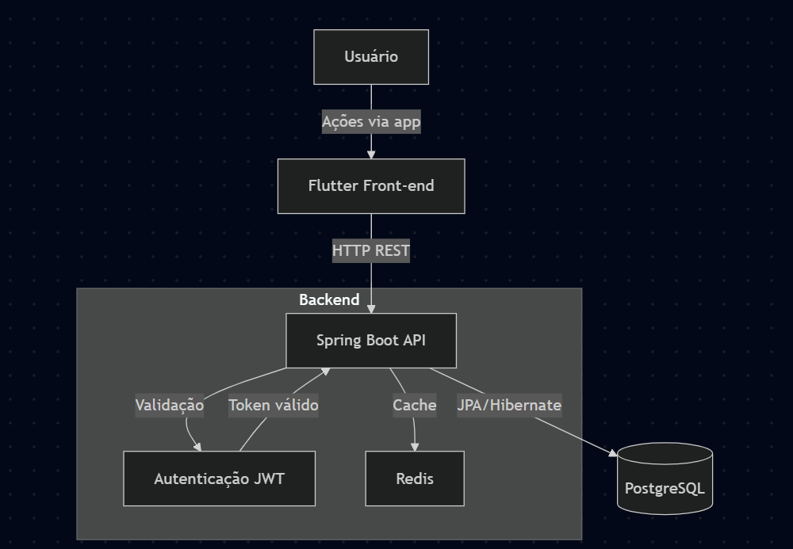
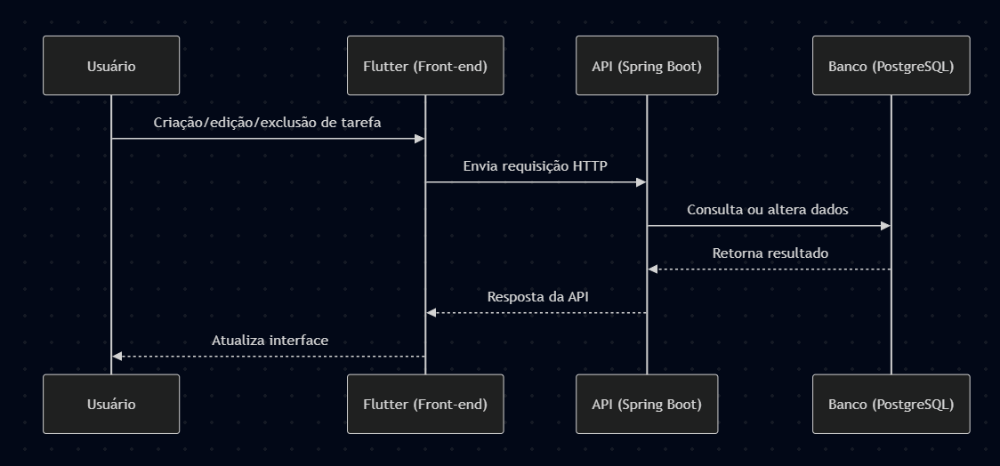
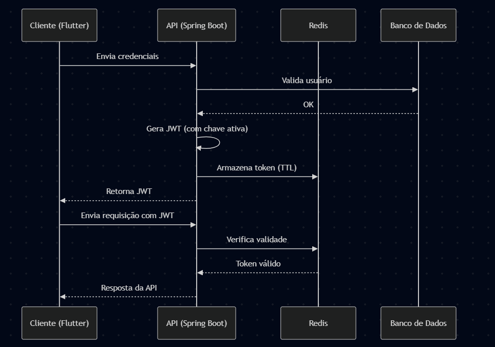

# Arquitetura do TaskMasterApp

## 📌 Visão Geral

O **TaskMasterApp** adota uma arquitetura baseada no modelo **Client-Server**, onde o front-end (Flutter) comunica-se com o back-end (Spring Boot) através de APIs REST. O sistema utiliza o banco de dados **PostgreSQL**, oferecendo escalabilidade, desempenho e segurança.

---

## 🧭 Diagrama Geral da Arquitetura

---

## 🔹 Componentes do Sistema

### **Front-end (Flutter)**

* Interface moderna, responsiva e intuitiva.
* Comunicação com a API por meio de requisições HTTP (REST).
* Gerenciamento de estado otimizado para melhor desempenho e experiência do usuário.

### **Back-end (Spring Boot)**

* API RESTful responsável pela lógica de negócios, controle de tarefas e autenticação de usuários.
* Autenticação baseada em JWT para garantir segurança nas transações.
* Integração direta com o banco de dados PostgreSQL.

### **Banco de Dados (PostgreSQL)**

* Armazenamento relacional e seguro de tarefas, usuários e demais entidades.
* Modelagem eficiente para suportar alto volume de operações com consultas performáticas.

---

## 🔄 Fluxo de Dados

---

## 🔐 Segurança e Autenticação

### 🔑 Diagrama da Estratégia JWT

---

## 🔒 Proteção de Endpoints e Dados

A API do back-end será protegida com as seguintes medidas:

* **Autenticação JWT obrigatória**
* **Controle de acesso por roles (`ADMIN`, `USER`)**
* **Mitigações contra ataques**:

  * CSRF
  * Rate Limiting
  * CORS restrito
* **Monitoramento com logging estruturado**

---

## 🔐 Criptografia de Dados

* **Senhas criptografadas com BCrypt e Salt**
* **Dados sensíveis (e-mail, token, etc.) com AES-256**
* **Rotina de expiração e renovação de senhas**

---

## ✅ Benefícios da Arquitetura de Segurança

* 🔒 Segurança contra ataques e vazamentos
* ⚡ Respostas rápidas e uso eficiente de cache
* 📈 Escalabilidade com autenticações simultâneas
* 🔁 Suporte à rotação segura de chaves JWT

---
